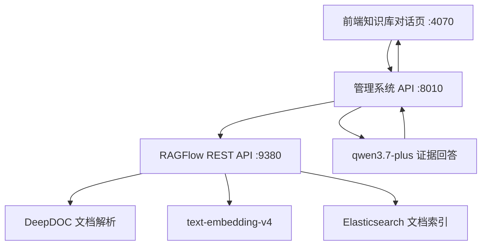

# RAGFlow 集成部署说明

## 当前架构

管理系统现在作为控制台，负责登录注册、知识库管理、文档元数据、前端交互、模型配置和审计记录。RAGFlow 作为底层 RAG 引擎，负责 DeepDOC 文档解析、分块、Embedding、Elasticsearch 索引和混合检索。问答阶段由管理系统调用 RAGFlow `/retrieval` 获取证据，再调用阿里云百炼兼容 OpenAI 接口生成最终回答。



## 端口

- 管理系统前端：http://localhost:4070
- 管理系统 API：http://localhost:8010
- RAGFlow Web：http://localhost
- RAGFlow API：http://localhost:9380
- RAGFlow Elasticsearch：http://localhost:1200
- RAGFlow MySQL：http://localhost:13306
- RAGFlow MinIO：http://localhost:9000 / 9001

说明：本机 Windows 保留了 `3080-3279` 端口段，所以前端改为 `4070`，避免 `3010/3110/3120` 绑定失败。

## 启动顺序

推荐使用项目脚本统一管理：

```powershell
cd D:\Researching\LLMStart\RAG
.\scripts\start-all.ps1
.\scripts\status-all.ps1
.\scripts\stop-all.ps1
```

如果需要临时启动旧的本地自研 RAG 管线（Qdrant + Celery worker），使用：

```powershell
.\scripts\start-all.ps1 -LegacyLocalRag
```

手动启动时，先启动 RAGFlow：

```powershell
cd D:\Researching\LLMStart\RAG\external-repos\ragflow\docker
docker compose up -d ragflow-gpu
```

再启动管理系统：

```powershell
cd D:\Researching\LLMStart\RAG
docker compose up -d --build
```

查看状态：

```powershell
docker compose ps
docker compose -f external-repos\ragflow\docker\docker-compose.yml ps
Invoke-RestMethod http://localhost:8010/api/health
```

## 为什么 Docker 里有两组容器

当前是“管理系统 + RAGFlow 引擎”的组合部署，所以 Docker Desktop 中会看到两组项目：

- `rag-*`：我们的管理系统。默认只保留 `frontend`、`api`、`postgres`、`redis`、`minio`。
- `docker-*`：RAGFlow 官方 compose 项目。包含 `ragflow-gpu`、`mysql`、`es01`、`minio`、`redis`。

其中 `docker-es01-1`、`docker-mysql-1`、`docker-minio-1`、`docker-redis-1` 是 RAGFlow 自己的依赖，不建议和管理系统的 Postgres/Redis/MinIO 混用。管理系统的 Postgres 存用户、权限、知识库映射、审计和回答记录；RAGFlow 的 MySQL/ES/MinIO/Redis 存解析任务、文档索引和 RAGFlow 内部状态。

旧的 `rag-qdrant-1` 和 `rag-worker-1` 属于项目早期自研 RAG 管线。现在默认不再启动，已放入 `legacy-local-rag` profile。当前目标链路是：

```text
管理系统前端 -> 管理系统 API -> RAGFlow API -> DeepDOC/Embedding/Elasticsearch -> 管理系统调用 Chat 模型回答
```

## 模型配置如何生效

RAGFlow 中已配置：

- Chat model：`qwen3.7-plus`
- Embedding model：`text-embedding-v4`
- Base URL：`https://dashscope.aliyuncs.com/compatible-mode/v1`
- Provider：`OpenAI-API-Compatible`

管理系统 `.env` 中已启用：

- `RAGFLOW_ENABLED=true`
- `RAGFLOW_BASE_URL=http://host.docker.internal:9380/api/v1`
- `LLM_PROVIDER=openai_compatible`
- `LLM_MODEL=qwen3.7-plus`

创建知识库时，管理系统会在 RAGFlow 创建对应 dataset，并把 `ragflow_dataset_id` 写入本地 `collections.metadata`。上传文档时，管理系统会把文件上传到 RAGFlow dataset，触发 DeepDOC 解析，并把 `ragflow_document_id` 写入本地 `documents.metadata`。问答时，管理系统调用 RAGFlow `/retrieval` 获取证据，再调用百炼 chat 模型基于证据生成答案。

## 已验证结果

使用 `D:\WordFile\Engineering_Ethics_Sensor_Fusion_Paper.docx` 完成端到端测试：

- 创建知识库成功
- 上传文档成功
- RAGFlow DeepDOC 解析成功
- 文档状态同步为 `ready`
- RAGFlow 检索返回中文证据 chunk
- 管理系统 `/api/chat` 返回带引用的中文回答
- 前端页面可完成登录、选择知识库、发起问答、展示证据分和引用
- 浏览器控制台没有前端错误
- 桌面和 390px 移动端均未发现横向溢出
- 已清理历史测试数据中的 `????` 坏编码名称，并在前端加入坏编码兜底显示

测试响应保存于：

```text
D:\Researching\LLMStart\RAG\data\management_api_e2e_response_utf8.json
```

## 前端调整

前端现在以“知识库对话”为主界面：

- 左侧：Logo、登录用户、知识库创建、知识库列表、模型路由管理
- 中间：知识库问答、快捷问题、证据分、引用卡片、自动滚动
- 右侧：资料导入、处理流程、文档治理、缺口运营、资料摘要
- 登录页使用项目 Logo，并去掉默认密码预填
- 网络断开时不再显示浏览器原始 `Failed to fetch`，改为可读的 API 连接提示
- 上传/导入后显示 RAGFlow 处理结果，例如“已解析完成，生成 N 个分块，并写入向量索引”
- 模型路由支持常用预设，切换模型只影响 Chat 生成模型，RAGFlow 继续负责解析、Embedding、索引和检索

## 已知限制

1. `D:\WordFile\1.txt` 内容偏脚本/噪声，不适合作为企业知识库资料，会污染召回结果。
2. RAGFlow `/chat/completions` 在当前环境中对中文 query 存在编码问题，所以管理系统暂时使用 `/retrieval + 自己调用 chat model` 的方式生成答案。
3. RAGFlow 首次解析文档时会初始化 Tika、torch 等依赖，第一次较慢，后续会明显变快。
4. 资料摘要目前仍依赖管理系统已有摘要接口，后续应改为基于 RAGFlow 检索证据和文档结构的专门摘要链路。
