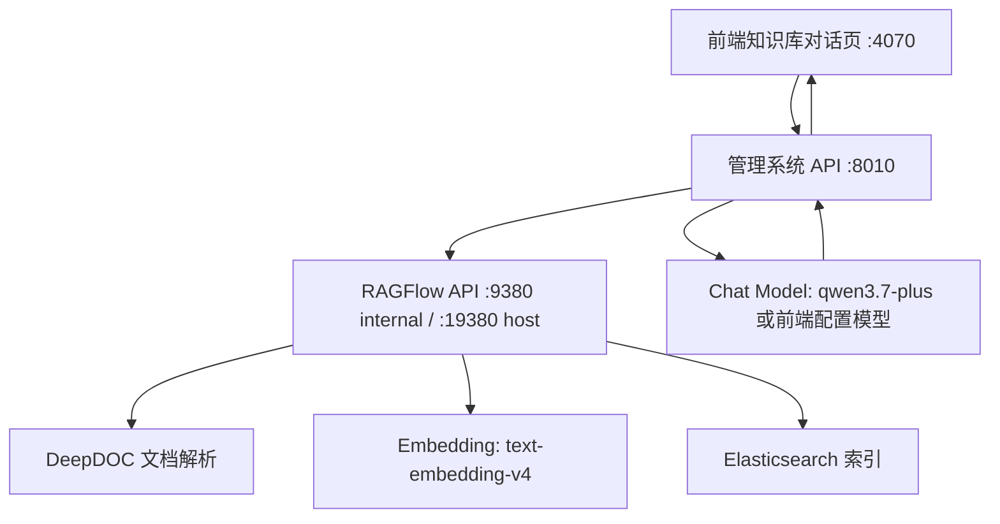

# RAGFlow 集成部署说明

## 当前架构

管理系统作为控制台，负责登录注册、知识库管理、文档元数据、模型配置、审计记录和前端交互。RAGFlow 作为底层 RAG 引擎，负责 DeepDOC 文档解析、分块、Embedding、Elasticsearch 索引和混合检索。问答阶段由管理系统调用 RAGFlow retrieval 获取证据，再调用当前启用的 Chat 模型生成最终回答。



## 端口

管理系统：

- 前端: http://localhost:4070
- API: http://localhost:8010
- MinIO API: http://localhost:9100
- MinIO Console: http://localhost:9101
- PostgreSQL: localhost:5432

RAGFlow：

- Web: http://localhost:18080
- HTTPS Web: https://localhost:18443
- API: http://localhost:19380
- Admin API: http://localhost:19381
- MCP: http://localhost:19382
- Elasticsearch: http://localhost:1200
- MySQL: localhost:13306
- MinIO: http://localhost:19000 / http://localhost:19001
- Redis/Valkey: localhost:6379

本机 Windows 曾出现 `3010` 端口无法绑定的问题，所以管理系统前端统一改为 `4070`。RAGFlow 官方 compose 的 Web/API/MinIO 端口也改成了 `18080/19380/19000` 等，避免和本机已有服务冲突。

## 启动顺序

启动 RAGFlow：

```powershell
cd D:\Researching\LLMStart\RAG\external-repos\ragflow\docker
docker compose --profile elasticsearch --profile gpu up -d
```

启动管理系统：

```powershell
cd D:\Researching\LLMStart\RAG
docker compose up --build -d
```

查看状态：

```powershell
cd D:\Researching\LLMStart\RAG
docker compose ps
Invoke-RestMethod http://localhost:8010/api/health

cd D:\Researching\LLMStart\RAG\external-repos\ragflow\docker
docker compose --profile elasticsearch --profile gpu ps
```

## 为什么 Docker 里有两组容器

当前是“管理系统 + RAGFlow 引擎”的组合部署，所以 Docker Desktop 中会看到两组项目：

- `rag-*`: 我们的管理系统，默认包括 `frontend`、`api`、`postgres`、`redis`、`minio`。
- `docker-*`: RAGFlow 官方 compose 项目，包括 `ragflow-gpu`、`mysql`、`es01`、`minio`、`redis`。

两组服务职责不同，不建议把管理系统的 PostgreSQL/Redis/MinIO 与 RAGFlow 的 MySQL/Redis/MinIO 混用。管理系统数据库保存用户、权限、知识库映射、审计、问答记录和 retrieval trace；RAGFlow 的数据库与索引保存解析任务、文档索引、分块和 RAGFlow 内部状态。

当前管理系统通过外部 Docker 网络 `docker_ragflow` 访问 RAGFlow：

```text
RAGFLOW_BASE_URL=http://ragflow-gpu:9380/api/v1
```

## 模型配置如何生效

RAGFlow 中配置：

- Chat model: `qwen3.7-plus`
- Embedding model: `text-embedding-v4`
- Base URL: `https://dashscope.aliyuncs.com/compatible-mode/v1`
- Provider: OpenAI-compatible

管理系统中配置：

- `.env` 控制是否启用 RAGFlow、RAGFlow API 地址、证据阈值、注册策略和上传限制。
- 前端左侧“模型路由”写入 `model_configs` 表，用于切换 Chat 生成模型。
- 切换 Chat 模型只影响最终回答生成；文档解析、Embedding、索引和检索仍由 RAGFlow 负责。

问答时的真实链路：

```text
用户问题
-> 管理系统按历史对话改写检索 query
-> RAGFlow retrieval 返回 chunks
-> 管理系统按本地文档 ACL 过滤 chunks
-> 证据不足则拒答并沉淀缺口
-> 证据足够则调用当前启用 Chat 模型
-> 保存 answer、citation、evidence_score、retrieval_trace
```

## 当前验证结果

- 管理系统容器：`rag-api-1`、`rag-frontend-1`、`rag-postgres-1`、`rag-redis-1`、`rag-minio-1` 均已启动。
- RAGFlow 容器：`docker-ragflow-gpu-1`、`docker-es01-1`、`docker-minio-1`、`docker-mysql-1`、`docker-redis-1` 均已启动。
- API health 返回 `{"status":"ok"}`。
- RAGFlow health 中 database / doc_engine / redis / storage 为 green。
- 前端 `http://localhost:4070` 可访问，中文显示正常，浏览器控制台无 error/warn。
- 容器内测试结果为 `15 passed`。

## 已知限制与后续建设

1. 表格型 PDF 的引用片段需要做结构化渲染，否则用户可能看到 `<table>` 片段。
2. 需要补齐真正的 `chat_sessions` / `chat_messages`，让聊天历史按用户和会话隔离。
3. 上传进度已经由状态同步支撑，但更理想的体验是 WebSocket/SSE 推送解析进度，而不是仅靠轮询。
4. 大文件和多表格评估需要构建标准评测集：问题、标准答案、引用位置、召回覆盖率、证据准确率、拒答率、延迟和成本。
5. 生产环境应关闭公开注册，接入 SSO/OAuth，并对模型 API Key 做数据库加密存储。
