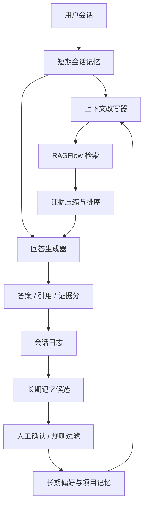

# RAG 智能体上下文记忆方案

## 当前问题

当前系统原先只有“单轮问题 -> RAGFlow 检索 -> LLM 回答”的链路。用户追问“这些问题”“它”“上一个文档”时，后端不会看到前文，因此检索 query 会丢失主题，容易把工程伦理论文、周报、部署问题混在一起。

## 已落地的第一阶段

1. 前端在 `/api/chat` 请求中携带最近 8 轮对话，只保留 `role` 和 `content`。
2. 后端先用对话历史把追问改写成独立检索 query，再交给 RAGFlow 检索。
3. 最终回答提示词会看到最近对话，但明确规定：对话历史只用于解析指代，事实必须来自 RAGFlow 返回的证据。
4. 回答和检索记录仍写入 `answers` 与 `retrieval_traces`，便于复盘“问题 -> 改写 query -> 命中证据 -> 回答”的链路。

## 企业级目标架构

## 后续增强建议

1. 会话维度：新增 `chat_sessions` 与 `chat_messages` 表，每个知识库可以保留多个会话，而不是只依赖前端内存。
2. 语义记忆：把“用户确认过的项目背景、术语、偏好、任务目标”写入独立 memory store，不把未经确认的模型回答直接沉淀。
3. 证据记忆：长期记忆只保存指向文档、chunk、answer、trace 的引用，避免脱离原文的二次幻觉。
4. 压缩策略：超过 8-12 轮后生成会话摘要，但摘要必须带“来源 answer_id / trace_id”，并可回放原始会话。
5. 反馈回路：低证据、用户纠错、负反馈自动进入评估集，形成固定 regression case。
6. Harness 化治理：把提示词、检索策略、评分阈值、评估集和验证脚本都版本化进仓库；每次改模型或 RAGFlow 参数后跑固定问答集。

## 评估指标

1. 指代追问命中率：例如“这些问题怎么解决的”是否延续上一轮主题。
2. 证据一致性：关键结论是否都能落到 citation。
3. 低证据拒答率：资料不足时是否明确说明缺什么，而不是编造。
4. 记忆污染率：不同知识库、不同会话之间是否串话。
5. 回归稳定性：同一评估集在模型切换后是否仍能给出可接受答案。
